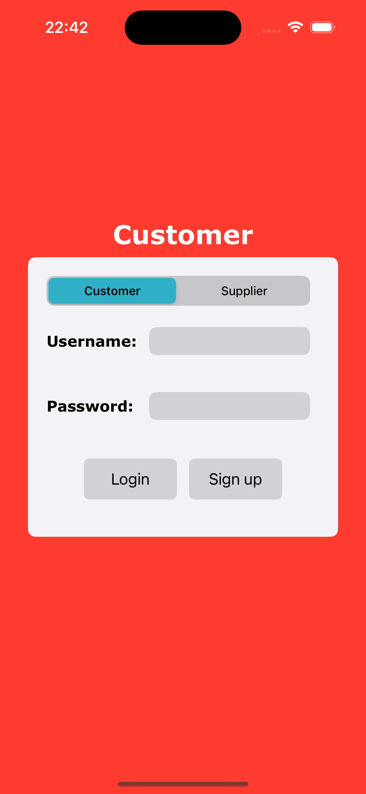
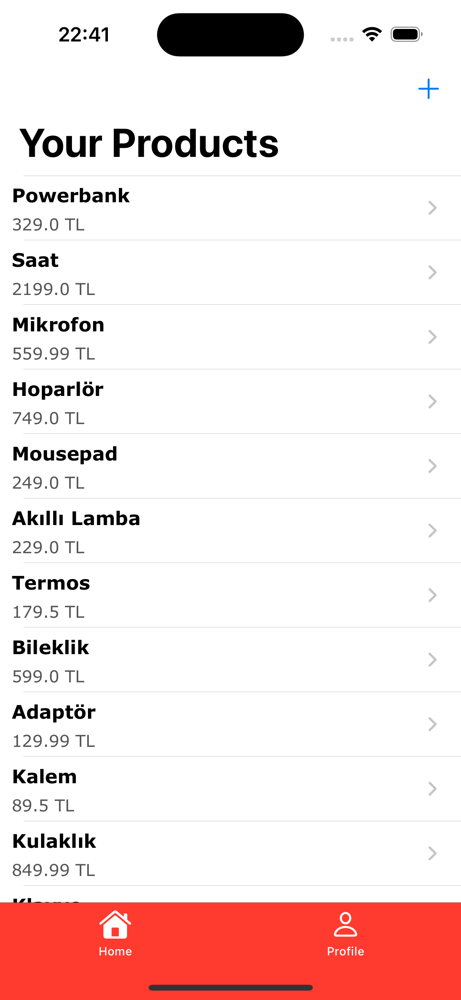
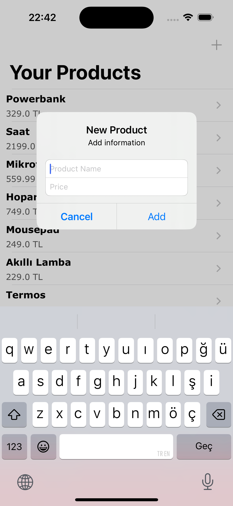
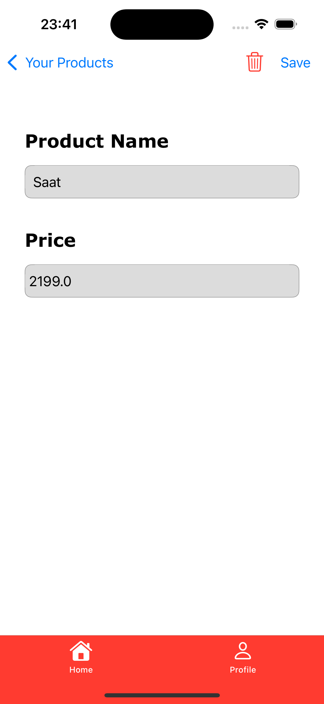
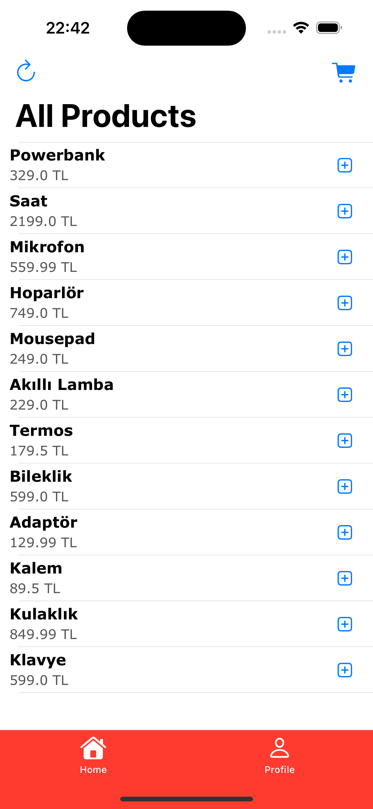
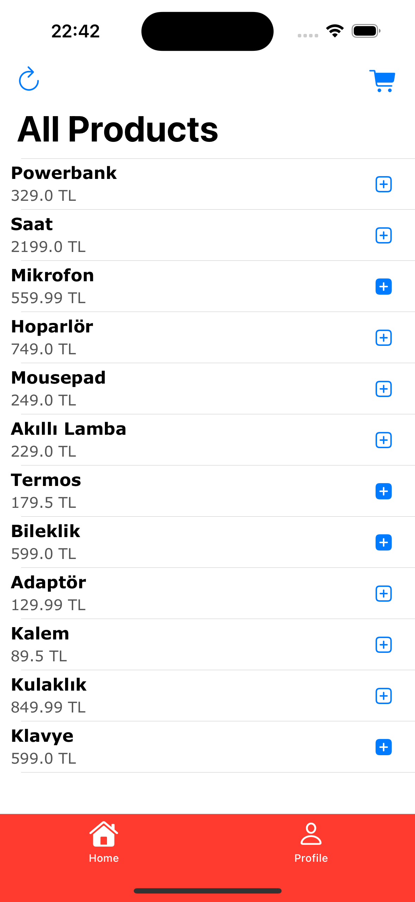
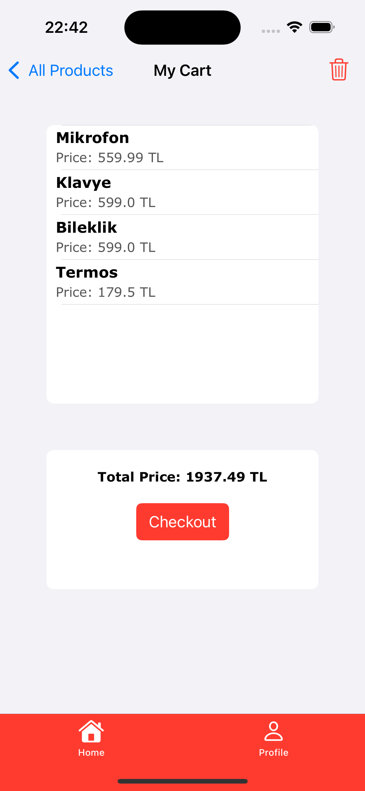

# Hybrid Database E-Commerce System

## Project Description

This project aims to help you practice integrating two different database technologies, MySQL (Relational Database) and MongoDB(NoSQL), in the same system. It focuses on developing e-commerce based scenarios such as user login, cart management, and order processing.

Main goal:
Developing a basic user login system and a shopping cart application on iOS using MySQL and MongoDB integration.

---

## Frontend

- iOS application with UIKit

---

## Backend Technologies

- Node.js
- Express.js
- MySQL (users and authentication)
- MongoDB (products and shopping cart)
- JWT (JSON Web Token) for authentication

---

## Project Structure

- `app.js`: Main application file containing API endpoints.
- `productSchema.js`: Mongoose schema for products.
- `cartSchema.js`: Mongoose schema for cart management.
- `package.json`: Project metadata and dependencies.

---

## Installation and Setup

### Backend

1. **Clone the repository:**
   ```bash
   git clone https://github.com/Erdinctpz/hybrid-db-ecommerce.git
   cd hybrid-db-ecommerce
   ```

2. **Install dependencies:**
   ```bash
   cd my_backend_app
   npm install
   ```

3. **MySQL Setup:**
   - Create a database named `users_ios`.
   - Create a table `users` with fields: `user_id`, `username`, `password`, and `role`.

4. **MongoDB Setup:**
   - Make sure MongoDB is running locally (`mongodb://localhost/shop_db`).
   - Collections (`products`, `carts`) will be automatically created when the first documents are inserted.

5. **Environment Variables:**
   - Update your `.env` file for environment variables like MySQL and MongoDB credentials, JWT secret key, and port.

6. **Start the server:**
   ```bash
   node app.js # or node app
   ```

### Frontend - iOS
1. **Open the Project:**
   - Open the ios_client folder in Xcode.

2. **Start the Backend Server:**
   - The iOS app sends requests to http://localhost:3000, so make sure the Node.js backend server is running before launching the app.

      > ⚠️ If you're testing on a physical device, replace localhost with your computer's local IP address in the code.

3. **Run the App:**
   - Choose a simulator in Xcode and press Cmd + R to build and run the application.

   **Note:**
      - The app is written in native Swift using URLSession for networking. No third-party libraries or additional setup is required.


---

## API Overview

| Method | Endpoint             | Role         | Description                       |
|--------|----------------------|--------------|-----------------------------------|
| POST   | `/login`              | All          | User login and JWT generation     |
| POST   | `/createUser`         | All          | Create a new user                 |
| GET    | `/users`              | All          | Fetch all users                   |
| POST   | `/getUserInfo`        | Authenticated| Get user info                     |
| POST   | `/updateUserInfo`     | Authenticated| Update user info                  |
| GET    | `/fetchProducts`      | Supplier     | Fetch supplier's products         |
| POST   | `/addProduct`         | Supplier     | Add a new product                 |
| POST   | `/updateProduct`      | Supplier     | Update an existing product        |
| POST   | `/deleteProduct`      | Supplier     | Delete a product                  |
| GET    | `/allProducts`        | Customer     | Fetch all products                |
| POST   | `/addToCart`          | Customer     | Add a product to cart             |
| GET    | `/getCart`            | Customer     | Get cart without populated products |
| GET    | `/getCartWithPopulate`| Customer     | Get cart with populated products  |
| POST   | `/removeProductFromCart` | Customer  | Remove a product from cart        |
| POST   | `/clearCart`          | Customer     | Clear all products from cart      |

---

## Notes

- JWT tokens must be included in the `Authorization` header as `Bearer <token>` for protected routes.
- Error handling is implemented for both databases separately.
- The system supports two types of users: **Customer** and **Supplier**.


---

## Testing with Postman


Example POST Request for Login:
URL: http://localhost/login
Method: POST
Body (JSON):

```
{
   "username": "exampleUser",
   "password": "password123"
}
```

Response:
```
{
   "token": "your_jwt_token_here"
}
```
---

## Screenshots


### Any User
<p float="middle">
  
</p>

---

### Supplier
<p float="middle">
  
  
  
</p>

---

### Customer

<p float="middle">
  
  
  
</p>